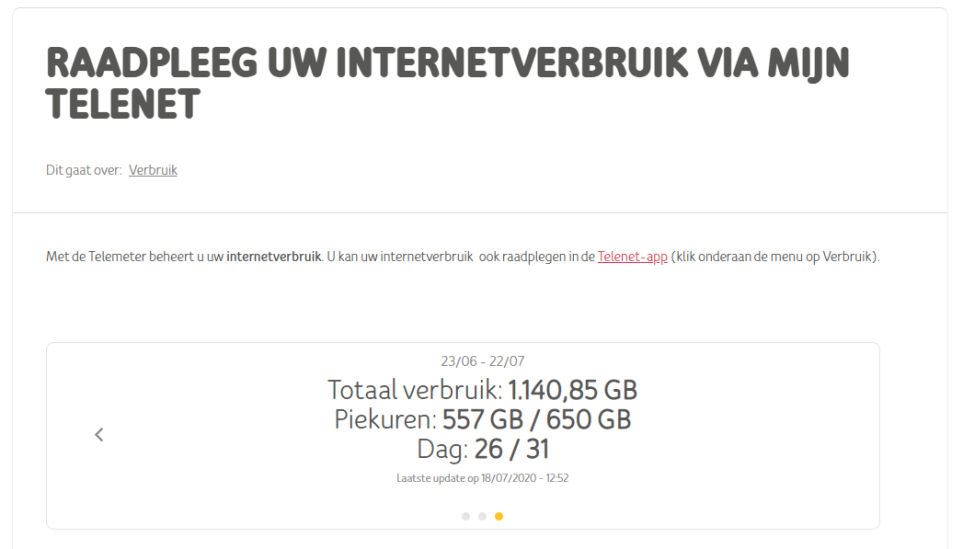

# TelemeterStats

Chrome extension that adds additional statistics for the Telemeter on the [Telemeter page](https://www2.telenet.be/nl/business/klantenservice/raadpleeg-uw-internetverbruik/):

- **Peak hours**: shows the peak hours progress over the desired amount. This desired amount is calculated based on the amount of days progressed in the current period. If there are 30 days in a month, then each day has an available amount of 25GB (750GB / 30days). The shown progress will then keep track of how intensive your usage is, so you know if you need to tone down your usage or not ;)
- **Day**: shows the current day in the current period over the total amount of days. This helps you track how many days you progressed in the current period and how many there are left.

*Note*: only works with the *All-Internet* package. I initially wrote this extension so I could keep track of my usage and not go over the data cap (750GB for the *All-Internet* package).

- Go to the [releases page](https://github.com/ZhongXiLu/TelemeterStats/releases) to download the latest version of the extension.

